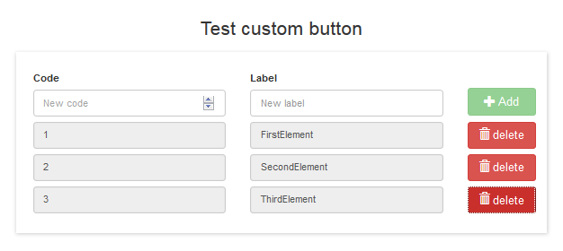
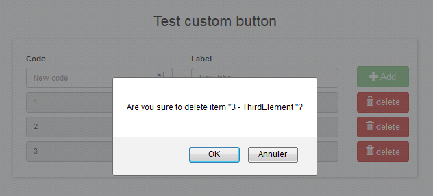

# customButton

## Description

Custom widget button for Bonita. Compatible with Bonita 7.3.2.

This custom button widget add three features to the standard widget :
* availability to add an icon (see : http://getbootstrap.com/components/)
* availability to add a confirmation message (usefull when you remove an item from a collection)
* availability to customize style (ex : { "min-width":"85px", "max-width":"100px", "margin-top":"20px" })

Customize style : 

Add confirmation message : 

## Installation 
1. add the widget widget-widgetButton.zip
2. add the test page page-testWidgetButton.zip

