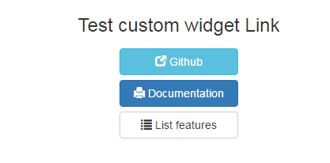

# customLink

## Description

Custom widget link for Bonita. 
Compatible with Bonita 7.3.2.

This custom link widget add two features to the standard widget :
* availability to add an icon (see : http://getbootstrap.com/components/)
* availability to customize style (ex : { "min-width":"85px", "max-width":"100px", "margin-top":"20px" })

This widget also add the "default" style.

Customize style : 

## Installation 
1. add the widget widget-widgetLink.zip
2. add the test page page-testWidgetLink.zip

