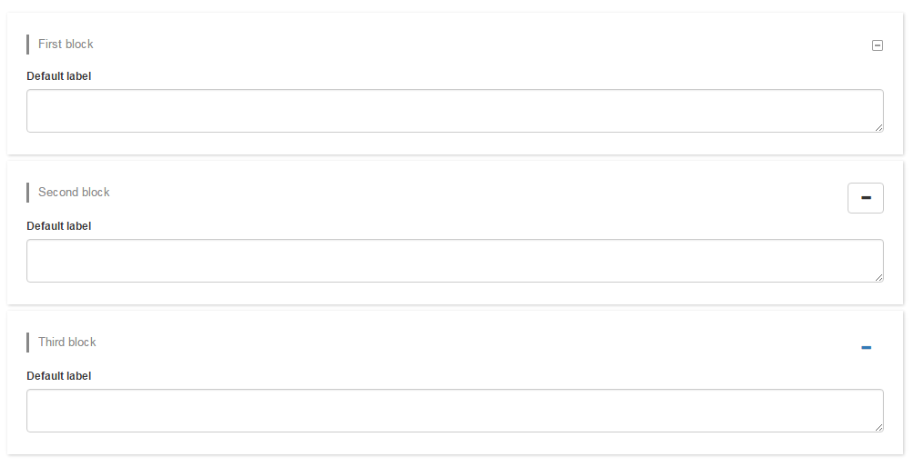
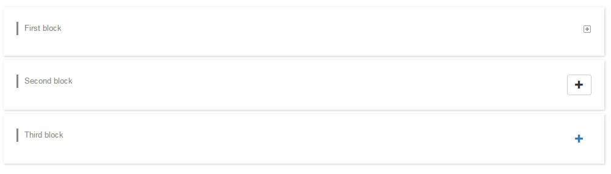

# customShowHide

## Description

Custom widget to hide/show a DOM element. 

You can customize the look and feel of the widget (image or button) 

Compatible with Bonita 7.3.2.

Screenshot 

## Installation 
1. add the widget widget-widgetShowHide.zip
2. add the test page page-testWidgetShowHide.zip

## Configuration

* Alignment : left, right or center
* Element selector : DOM element to show/hide (ex : .firstElement, #element1)
* Look and feel : image or button