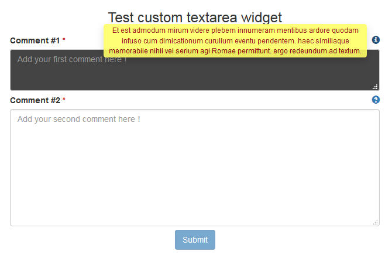

# customTextArea

## Description

Custom widget textArea for Bonita. Compatible with Bonita 7.3.2.

This custom textArea widget add three features to the standard widget :
* availability to add a placeholder
* availability to customize style (ex : { "background-color" : "#444", "color" : "#FFF" }, { "height":"200px" })
* availability to add a tooltip, with thoses options :
  * Tooltip message 
  * Tooltip message position
  * Tooltip icon (see http://getbootstrap.com/components/)
  * Tooltip custom CSS class

Screenshot 

## Installation 
1. add the widget widget-widgetTextArea.zip
2. add the test page page-testWidgetTextArea.zip
